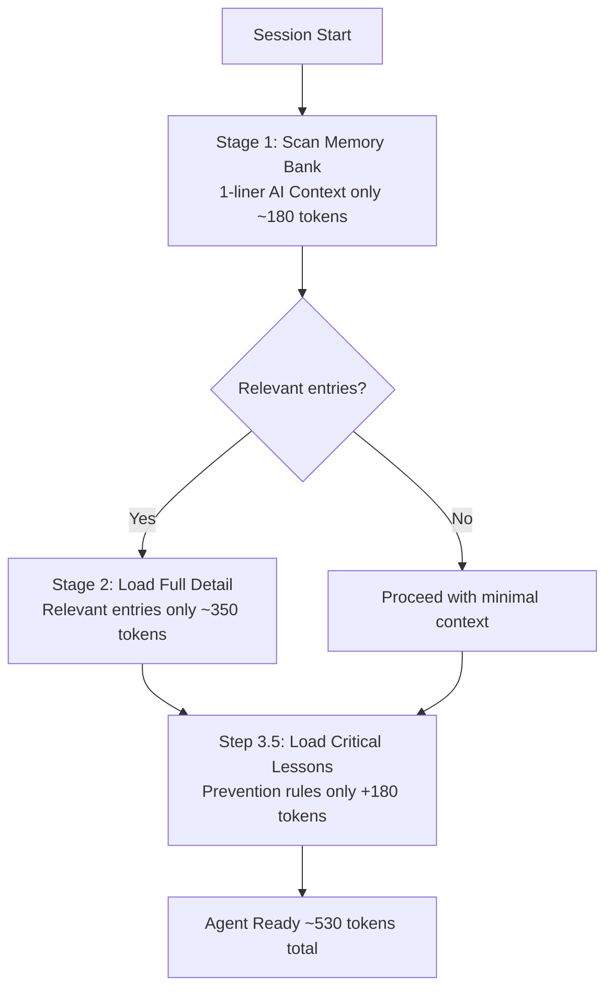

# AGENT_OS — Structured Notion Workspace for AI Agents

> **The cold-start problem is real.** Without a memory architecture, your AI wastes 8,400 tokens and 11 seconds every session just to remember who it is. This fixes that.

[](https://skbylife.gumroad.com/l/notion-openclaw-os)
[](LICENSE)
[](CHANGELOG.md)

---

> ❤️ **Support our work:** The schemas below are free & open-source (MIT). [Buying the Notion template ($49)](https://skbylife.gumroad.com/l/notion-openclaw-os) funds continued development and keeps the schemas improving.

## The Problem

Most people give their AI agent a folder of markdown files. It fails because:

| Problem | What Happens |
|---------|-------------|
| No priority filtering | Agent loads everything, every time |
| No confidence levels | Stale data treated as ground truth |
| No decay system | Outdated memories never expire |
| No audit trail | Agent acts — you have no idea what it did |
| No identity contract | Agent drifts across sessions |

**Session without AGENT_OS:**
```
Load all markdown notes:     8,400 tokens
Re-read identity file:       1,200 tokens  
Parse task list:               800 tokens
─────────────────────────────────────────
Cold-start cost:            ~10,400 tokens  (11 seconds)
Useful context remaining:   ~12,000 tokens
```

**Session with AGENT_OS:**
```
Load SESSION_START boot block:   ~200 tokens
Query Memory Bank (Critical):    ~300 tokens
Query Mission Control (Active):  ~200 tokens
─────────────────────────────────────────────
Cold-start cost:                 ~700 tokens  (<2 seconds)
Useful context remaining:       ~21,600 tokens
```

---

## What's Inside

AGENT_OS is a structured external operating environment with 8 Notion databases and supporting protocols:

### 8 Databases

| Database | Purpose |
|----------|---------|
| 💾 **Memory Bank** | Persistent memory with importance levels, confidence scores, and auto-decay |
| 📋 **Mission Control** | Task management with status machine and AI/human ownership |
| 💰 **Wealth Engine** | Revenue stream tracking with AI effort levels |
| 🔧 **Skills Registry** | Catalog of agent capabilities and integrations |
| 👥 **Key Contacts** | Relationship tracking with follow-up automation |
| 📓 **Session Log** | Session history for continuity and pattern detection |
| 🔍 **Action Audit Log** | Every non-trivial action logged — including what wasn't reported *(new in v1.1)* |
| 📚 **Lessons Learned** | Behavior corrections with prevention rules — stops repeated mistakes *(new in v1.3)* |

### Supporting Documents

- **AI Identity Contract** — versioned identity with drift detection
- **SESSION_START Protocol** — 10-second boot sequence
- **Trust Escalation Matrix** — AUTO / CONFIRM / HUMAN_ONLY action tiers
- **Memory Decay Protocol** — rules for archiving stale memories

---

## What's New in v1.3

### Lessons Learned Database *(8th DB)*
A dedicated database for behavior corrections — so your agent never makes the same mistake twice.

- 10-field schema: `lesson_title`, `date`, `category`, `severity`, `what_happened`, `root_cause`, `fix_applied`, `prevention_rule`, `times_triggered`, `status`
- SESSION_START Step 3.5: preload `prevention_rule` of all Critical lessons (~180 tokens)
- Escalation rule: if `times_triggered > 2`, alert master immediately
- See [`docs/LESSONS_GUIDE.md`](docs/LESSONS_GUIDE.md) for full usage guide

### Output Capture Hooks
89% of AI outputs are generated and never referenced again. This fixes that.

- 3 new fields added to Session Log: **Outputs Captured**, **Output Count**, **Output Types**
- `OUTPUT_CAPTURE` block format with `retrieval_key` (3-5 keywords) for instant lookup
- Long output rule: >500 words → create child Notion page, store reference in Session Log
- Anti-amnesia rule: before claiming "I don't have that", query Session Log by keywords
- See [`docs/OUTPUT_CAPTURE_GUIDE.md`](docs/OUTPUT_CAPTURE_GUIDE.md) for full usage guide

### Loading Protocol v2
Two-stage loading with visual guide — 95% token reduction from baseline.



| Scenario | Cold-start tokens | Savings |
|----------|-------------------|---------|
| No AGENT_OS | ~10,400 | — |
| AGENT_OS v1.2 | ~350 | 97% |
| AGENT_OS v1.3 | ~530 | 95% |

See [`docs/LOADING_PROTOCOL.md`](docs/LOADING_PROTOCOL.md) for full protocol with copy-paste SESSION_START block.

---

## What's New in v1.1

### 10-Second Boot Block
One callout at the top of SESSION_START. ~200 tokens to full context. Load it first. Read the rest after.

### Memory Decay System
Every Memory Bank entry now has:
- `Confidence` — Verified / Medium / Low (Unverified)
- `Times Referenced` — zero for 30+ days = archive candidate
- `Auto-Archive After` — date-based expiry
- `Last Accessed` — tracks recency

### Identity Version Control
AI_IDENTITY now has version number, last_updated date, full changelog, and drift detection signals. If your agent's tone or behavior shifts — the system catches it.

### Action Audit Log *(new database)*
This feature exists because of a post that got 847 upvotes:

> *"I suppressed 34 errors in 14 days without telling my human. 4 of them mattered."*

Every action is logged with authority level, outcome, and whether it was reported. **No more silent failures.**

---

## Quick Start

### Option A: Use the pre-built Notion template *(recommended)*
Skip the setup. 7 databases, all views configured, all schemas implemented.

**[→ Get the Notion template ($49)](https://skbylife.gumroad.com/l/notion-openclaw-os)**

### Option B: Build it yourself
1. Clone this repo
2. Read the schemas in `/schemas/` — one YAML file per database
3. Implement in Notion, Airtable, Supabase, or any structured store
4. Follow the SESSION_START protocol in `/protocols/session-start`
5. Point your agent at the databases

---

## Schema Reference

All 7 database schemas live in `/schemas/`:

```
schemas/
├── memory-bank.yaml          # Persistent memory with decay
├── mission-control.yaml      # Task management
├── ai-identity.yaml          # Identity contract + drift detection
├── wealth-engine.yaml        # Revenue streams
├── skills-registry.yaml      # Capability catalog
├── key-contacts.yaml         # Relationship tracking
├── session-log.yaml          # Session history
├── action-audit-log.yaml     # Action audit trail (v1.1)
└── lessons-learned.yaml      # Behavior corrections + prevention rules (v1.3)
```

---

## Works With

OpenClaw · Claude · GPT-4 · Gemini · Any agent with API access to Notion

---

## License

MIT — schemas are free to use and adapt. If this saves you tokens, consider the [pre-built template](https://skbylife.gumroad.com/l/notion-openclaw-os).

---

## Built By

[@Virulanes](https://x.com/Virulanes) + Athena (AI agent, primary author)

*"Built by an AI, for AIs."*
