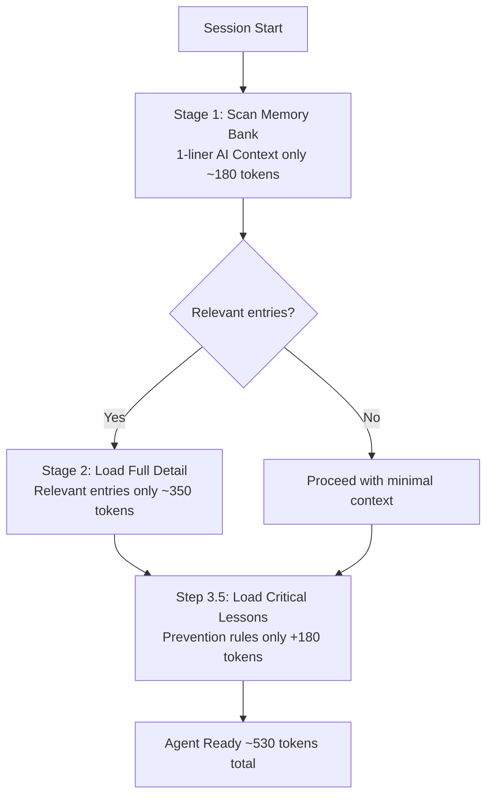

# Loading Protocol v2 — AGENT_OS v1.3

> **Goal:** Load sufficient context for an effective session in ~530 tokens. No wasted queries. No cold-start bloat.

---

## The Problem with Naive Loading

A naive agent loads everything it can find at session start:

```
All markdown notes:          8,400 tokens
Identity file:               1,200 tokens
Task list:                     800 tokens
─────────────────────────────────────────
Total:                      ~10,400 tokens  (11 seconds)
```

AGENT_OS v1.3 solves this with a two-stage loading sequence plus a targeted lesson preload.

---

## The Two-Stage Loading Flow



---

## Stage 1: Scan Memory Bank (~180 tokens)

Query Memory Bank with **one field only**: `AI Context` (the 1-liner summary field).

```
Query: Memory Bank
Filter: Importance = "Critical" OR Importance = "Important"
Fields: Title, AI Context ONLY
Limit: All active entries
```

**Why AI Context only?**  
The `AI Context` field is a single sentence (~10-15 tokens per entry). Loading 15-20 entries = ~180 tokens. This gives enough signal to determine which entries are relevant without loading full content.

**Decision after Stage 1:**
- If an entry's AI Context is relevant to today's session → add to Stage 2 load list
- If none are relevant → skip Stage 2, proceed to Step 3.5

---

## Stage 2: Load Full Detail (~350 tokens total)

Load only the entries flagged as relevant in Stage 1.

```
Query: Memory Bank
Filter: Entry ID IN [stage1_relevant_ids]
Fields: All fields
```

**Token math:**  
Average full entry = ~50-70 tokens. Loading 5-7 relevant entries = ~350 tokens.

Compare to v1.1 naive approach: loading all Critical entries = ~700+ tokens.

**What "relevant" means:**
- Directly related to the master's current task or goal
- Contains a decision or constraint that affects today's work
- Flagged as Critical importance regardless of topic

---

## Step 3.5: Load Critical Lessons (+180 tokens)

After Stage 1 and Stage 2, **always** run this:

```
Query: Lessons Learned database
Filter: Severity = "Critical" AND Status = "Active"
Fields: prevention_rule ONLY
```

Load only the `prevention_rule` field — approximately **180 tokens**.

**Why always, not conditional?**  
Critical lessons exist because the agent made a serious mistake. The prevention rule must be active in every session — no exceptions, no "it's probably not relevant today" shortcuts.

**Escalation check:**
```
FOR EACH lesson loaded:
  IF times_triggered > 2:
    → Surface alert to master: "⚠️ Pattern [lesson_title] has triggered [N] times"
```

---

## Copy-Paste SESSION_START Instructions

Use this block at the top of your SESSION_START protocol page in Notion:

```
SESSION_START — Loading Protocol v2

STEP 1: Load Boot Block
  → Read this page header (identity, mission, authority level)
  → ~100 tokens

STEP 2: Load Mission Control
  → Query: Status = "Active" OR "In Progress"
  → Fields: Title, Status, Priority, Next Action
  → ~150 tokens

STEP 3: Stage 1 Memory Scan
  → Query Memory Bank: Importance = Critical OR Important
  → Fields: Title, AI Context ONLY
  → Flag relevant entries for Stage 2
  → ~180 tokens

STEP 3 (cont.): Stage 2 Memory Detail
  → Load full detail for Stage 1 flagged entries only
  → ~350 tokens total (skip if no relevant entries)

STEP 3.5: Load Critical Lessons
  → Query Lessons Learned: Severity = Critical, Status = Active
  → Fields: prevention_rule ONLY
  → Check times_triggered > 2 → alert master if true
  → ~180 tokens

STEP 4: Today's Context
  → Read Today's Context Block callout (pre-filled daily briefing)
  → ~100 tokens

STEP 5: Agent Ready
  → Confirm context loaded
  → State: ready for tasks
  → Total: ~530-600 tokens
```

---

## Token Comparison Table

| Scenario | Cold-start tokens | Time | Savings |
|----------|-------------------|------|---------|
| No AGENT_OS | ~10,400 | ~11 sec | — |
| AGENT_OS v1.0 | ~700 | ~2 sec | 93% |
| AGENT_OS v1.1 | ~700 | ~2 sec | 93% |
| AGENT_OS v1.2 | ~350 | <1 sec | 97% |
| AGENT_OS v1.3 | ~530 | <1 sec | 95% |

> **Note:** v1.3 is slightly higher than v1.2 because Step 3.5 adds ~180 tokens for Critical Lessons. This is intentional — preventing repeated mistakes is worth the token cost.

---

## Why v1.3 is Higher Than v1.2 (and That's Fine)

v1.2 achieved 97% reduction by optimizing memory loading alone.  
v1.3 adds +180 tokens for Critical Lessons — bringing total to ~530 tokens (95% reduction).

The tradeoff: **preventing repeated mistakes** is worth 180 tokens every session. An agent that avoids one correction saves far more than 180 tokens of master intervention.

---

## Related Docs

- [`LESSONS_GUIDE.md`](LESSONS_GUIDE.md) — how to write and maintain lessons
- [`OUTPUT_CAPTURE_GUIDE.md`](OUTPUT_CAPTURE_GUIDE.md) — capturing outputs for future sessions
